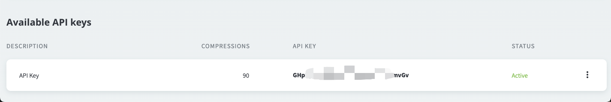

tiny 命令行压缩

[github地址]([github](https://github.com/frxing/tiny)) : https://github.com/frxing/tiny

[gitee地址]([gitee](https://gitee.com/btoa/tiny)) : https://gitee.com/btoa/tiny

### 使用方法

**安装**

```bash
 npm install -g @frxing/tiny
```
> 此时全局就多了3个命令：tiny 、ty 、ti。三个命令相同，ti/ty只是简写形式

**使用**
1. 注册tinypng的apikey。
   
   

2. 添加apikey
  
  ```bash
   ty addKey ***************
  ```
3. 进入图片目录，右键从终端打开（macOs: 右键-服务-新建位于文件夹位置的终端标签页）。
  
  ```bash
   # 压缩整个文件夹里面的图片
   ty 

   # 压缩某一张图片
   ty ./*.png

   # 压缩某个目录
   ty */*
  ```

4. 压缩完成后会在文件的同级多了一个dest目录存放压缩后的图片
